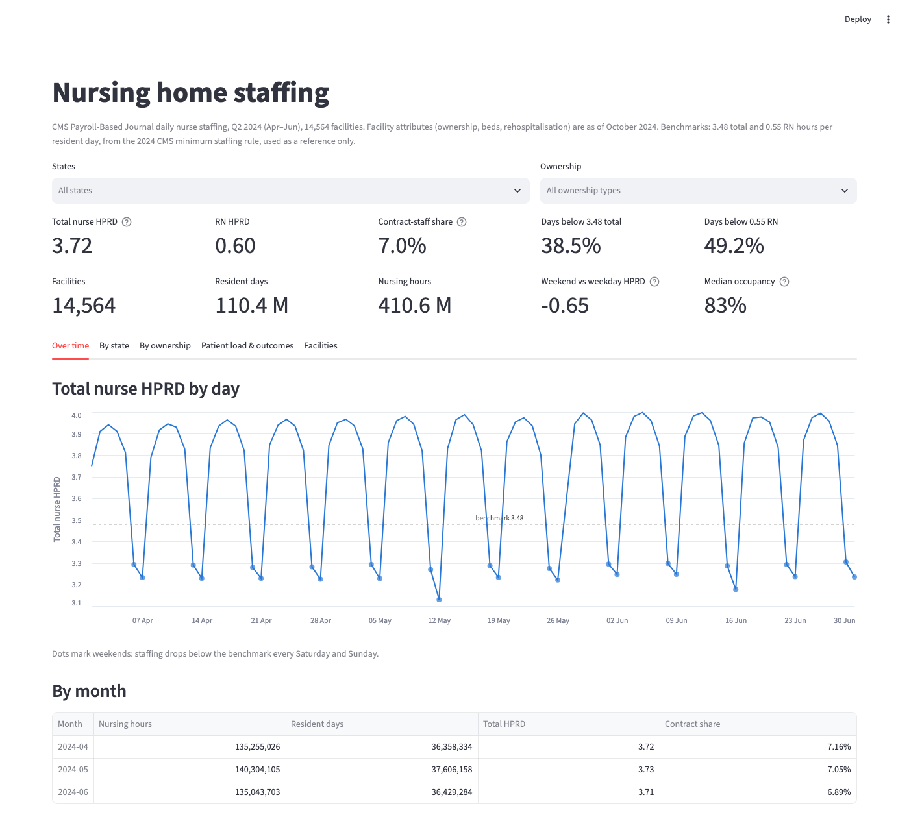
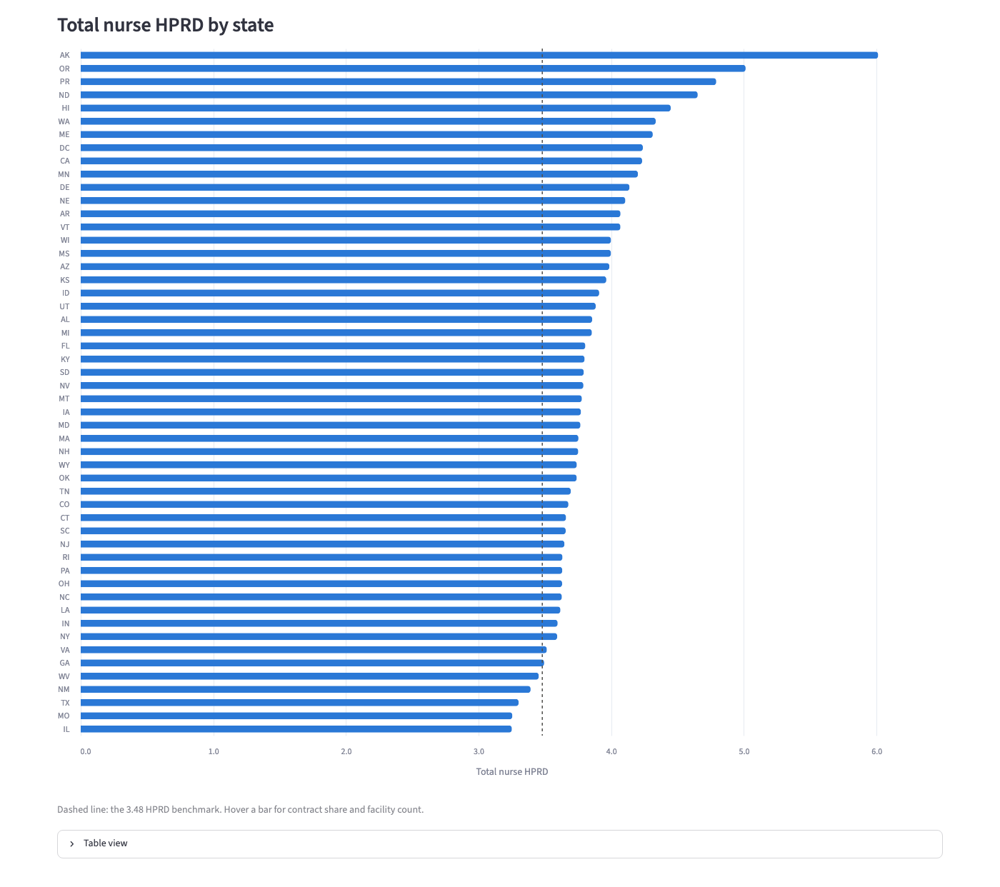
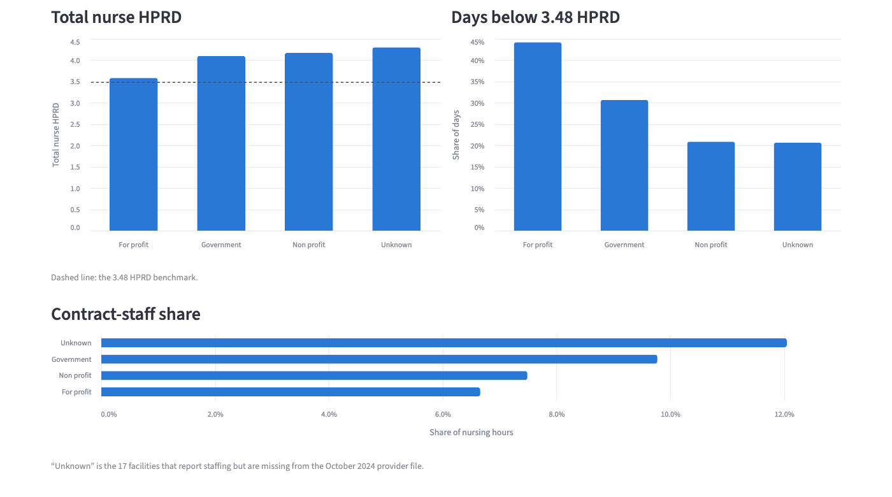
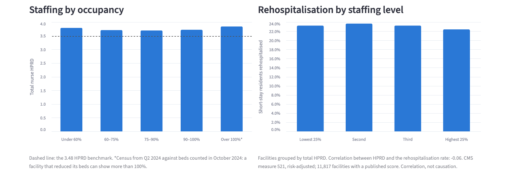

# Healthcare Staffing Lakehouse

An AWS lakehouse that turns CMS nursing-home staffing data (Payroll-Based Journal, Q2 2024, ~1.3M daily facility records) into staffing metrics and a dashboard: nurse hours per resident day, contract-staff share, and how often facilities fall below the CMS 2024 staffing benchmark.



## Key findings

- **Weekends are the biggest staffing gap.** Nursing hours per resident day (HPRD) fall from 3.91 on weekdays to 3.26 on weekends, and RN hours per resident drop 40%. Every weekend of the quarter is below the 3.48 benchmark.
- **Ownership matters more than occupancy.** For-profit facilities staff 3.58 HPRD and spend 44% of days below the benchmark; non-profits staff 4.17 and spend 21%. Staffing per resident is nearly flat across occupancy levels (correlation −0.06).
- **The RN benchmark is the harder one.** 47% of facilities average below 0.55 RN HPRD, against 37% below 3.48 total, so the two are reported separately.
- **Staffing barely predicts rehospitalisation** (correlation −0.06 across 11,817 facilities): a modest signal at most, and correlation, not causation.
- **Biggest state gaps:** Illinois and Missouri (3.25 HPRD) and Texas (3.30) are lowest; Alaska (6.01) and Oregon (5.01) are highest.

The answers to the brief's four questions, including the two the data can't answer (overtime and length of stay) and the closest measure for each, are in **[Findings](docs/findings.md)**.

| By state | By ownership | Patient load and outcomes |
|---|---|---|
|  |  |  |

## Architecture


- **Ingestion:** a Glue Python shell job copies CSVs from Google Drive into S3 incrementally, tracked in a DynamoDB manifest.
- **Medallion layers:** bronze (raw CSV in S3), silver (validated Iceberg tables), gold (star schema and metrics), all queried with Athena.
- **Quality gates:** each run builds new tables, checks them, and publishes only if the checks pass (write-audit-publish).
- **Orchestration:** Step Functions, started manually.
- **Infrastructure:** everything in Terraform, deployed to `us-west-2`.

A full run (copy, build, check, publish) takes about 3 minutes and costs a few cents. A rerun with no new files ends after the copy step.

## Documentation

| Document | What's in it |
|---|---|
| [Solution design](docs/solution-design.md) · [summary](docs/solution-design-summary.md) | Architecture, why each service was chosen, rejected alternatives, data quality, failure handling, security, cost, risks |
| [Data profile](docs/data-profile.md) | What profiling the source data found, and the validation rule each finding became |
| [Data dictionary](docs/data-dictionary.md) | Every table and column, from bronze to gold, with metric definitions and reject reasons |
| [Findings](docs/findings.md) | Answers to the brief's questions, with conclusions and limits |

## What changed during the build

The design was approved before any code was written. These four changes came from evidence found while building, and each one is recorded in the design doc:

1. **The Glue crawler was removed.** It guessed column types from the start of each file and typed facility IDs as numbers, but 235 facilities have IDs like `39A433`, and every query on the main table failed. The ingestion job now registers each table itself, with every column as text, and silver converts the types.
2. **The pipeline went from 23 minutes to under 3.** Step Functions' `.sync` integration for Athena checks for completion only about once a minute, so 23 quick queries took 23 minutes. A 3-second polling loop replaced it.
3. **Files go through a temporary file instead of a pure stream.** A file's encoding is only known after reading all of it (PBJ is Windows-1252), so each file is downloaded to local disk, verified against Drive's MD5 and converted to UTF-8 in one pass.
4. **Validation rules come from profiling.** 2,522 days with residents but no recorded nursing hours, and 75 days with impossible staffing, are quarantined with a reason rather than averaged into the metrics.

## Tech stack

AWS (S3, Glue, Athena, Step Functions, DynamoDB, Secrets Manager, CloudWatch, SNS) · Apache Iceberg · Terraform · Python · SQL · Streamlit

## Repository layout

| Path | Contents |
|---|---|
| `docs/` | Solution design, data profile, data dictionary, findings, diagram and screenshots |
| `terraform/` | Infrastructure as code  |
| `glue/drive_sync/` | Ingestion job: copies new or changed CSVs from Google Drive to S3 (Python 3.9, Glue Python shell) |
| `sql/` | Bronze profiling, silver validation views, gold star schema and metrics, data checks, publish views |
| `scripts/` | Local data checks: file inventory and encoding check |
| `dashboard/` | Streamlit dashboard on the published marts |
| `data/` | Local source files (not committed; see `data/README.md`) |

## Development setup

The root environment needs **Python 3.11 or newer** (the scripts and the dashboard use newer standard-library features).

```bash
python3 -m venv .venv
source .venv/bin/activate
python -m pip install -r requirements-dev.txt
pre-commit install
```

### Commit checks (pre-commit)

`pre-commit install` sets up a Git hook, so these checks run on every `git commit` (configured in `.pre-commit-config.yaml`):

| Check | What it does |
|---|---|
| **gitleaks** | Blocks the commit if it finds a secret (keys, tokens, passwords). This is a public repo, so nothing sensitive may be committed. |
| `detect-private-key` | Blocks private keys, such as a Google service-account JSON |
| `check-added-large-files` | Blocks files over 1 MB (the source CSVs stay in `data/`, which is git-ignored) |
| `terraform_fmt` | Formats `.tf` files (needs Terraform installed) |
| `check-yaml`, `check-json`, `check-merge-conflict` | Catch broken config files and leftover merge markers |
| `end-of-file-fixer`, `trailing-whitespace` | Tidy whitespace |

- **Run them by hand** on every file: `pre-commit run --all-files`
- **If a check fixes a file** (formatting or whitespace), the commit stops. Run `git add` on the changed files and commit again.
- **If gitleaks blocks a commit,** remove the secret. Don't bypass it with `--no-verify`. A pushed secret should be treated as leaked and rotated.
- **Update the pinned versions:** `pre-commit autoupdate`, then commit the updated config.
- **macOS `CERTIFICATE_VERIFY_FAILED`** on the first run (Python from python.org): run *Install Certificates.command* from the Python folder in Applications.

### Ingestion job environment

The ingestion job has its own environment, because AWS Glue Python shell runs **Python 3.9**. It's created with [uv](https://docs.astral.sh/uv/):

```bash
cd glue/drive_sync
uv venv --python 3.9
source .venv/bin/activate
uv pip install -r requirements-dev.txt
```

`requirements.txt` pins the Google client libraries. Terraform reads the same file when it deploys the job, so local runs and AWS use the same versions.

## Deployment

All infrastructure is defined in Terraform and deployed to `us-west-2`, in two stacks applied in order: `bootstrap` (the state bucket) and `envs/dev` (the project).

### Prerequisites

- Terraform 1.10 or newer (needed for S3 native state locking)
- AWS CLI v2, signed in to the target account: `aws sts get-caller-identity` should show it
- Permission in that account to create S3 buckets and the project's resources

### 1. Fill in your settings

Each stack refuses to run against any other account (`allowed_account_ids`). Copy the example files and set `account_id` to the number printed by the last command, `alert_email` to the address that should receive budget and failure alerts, and (in `envs/dev`) `drive_folder_id` to the ID of the Google Drive folder with the source files (the last part of its URL). The real `terraform.tfvars` files are git-ignored.

```bash
cp terraform/bootstrap/terraform.tfvars.example terraform/bootstrap/terraform.tfvars
cp terraform/envs/dev/terraform.tfvars.example terraform/envs/dev/terraform.tfvars
aws sts get-caller-identity --query Account --output text
```

### 2. Bootstrap the state bucket (once)

Creates a versioned, encrypted, TLS-only S3 bucket for Terraform state, protected against deletion. This small stack keeps its own state file locally (git-ignored).

```bash
terraform -chdir=terraform/bootstrap init
terraform -chdir=terraform/bootstrap apply
terraform -chdir=terraform/bootstrap output state_bucket_name
```

### 3. Deploy the dev environment

Set `bucket` in the `backend "s3"` block of `terraform/envs/dev/versions.tf` to the bucket name from step 2. It has to be typed in literally, because Terraform reads the backend during `init`, before any variables exist.

```bash
terraform -chdir=terraform/envs/dev init
terraform -chdir=terraform/envs/dev plan
terraform -chdir=terraform/envs/dev apply
```

The dev state is stored in the bucket at `envs/dev/terraform.tfstate` and locked during every run, so two applies can't overlap.

### 4. Give the pipeline read access to Google Drive

1. In Google Cloud, create a project, enable the **Google Drive API**, and create a service account with a JSON key.
2. Share the Drive folder that holds the source files with the service account's email, as **Viewer**.
3. Store the key in the secret Terraform created, then delete the local copy. The key never goes into Git or Terraform state.

```bash
aws secretsmanager put-secret-value --region us-west-2 \
  --secret-id "$(terraform -chdir=terraform/envs/dev output -raw google_secret_name)" \
  --secret-string file://path/to/key.json
rm path/to/key.json
```

### 5. Run the ingestion job locally

The job copies every new or changed CSV in the Drive folder to `raw/` in the lake bucket, registers it as a table in the `raw` Glue database, and records it in the DynamoDB manifest. Run it from the job's environment (see [Ingestion job environment](#ingestion-job-environment)). The folder ID is the last part of the folder's Drive URL.

```bash
cd glue/drive_sync
python drive_sync.py \
  --folder_id <drive-folder-id> \
  --bucket "$(terraform -chdir=../../terraform/envs/dev output -raw lake_bucket_name)" \
  --manifest_table "$(terraform -chdir=../../terraform/envs/dev output -raw dynamodb_manifest_table_name)" \
  --secret_name "$(terraform -chdir=../../terraform/envs/dev output -raw google_secret_name)" \
  --raw_database hsl_dev_raw
```

Running it a second time copies nothing: only new or changed files are copied.

### 6. Run the ingestion job in AWS Glue

`terraform apply` (step 3) deploys the same script as the Glue Python shell job `hsl-dev-drive-sync`, with its settings (including `drive_folder_id` from step 1) passed as job arguments.

```bash
aws glue start-job-run --job-name hsl-dev-drive-sync --region us-west-2
aws glue get-job-runs --job-name hsl-dev-drive-sync --max-items 1 \
  --query 'JobRuns[0].[JobRunState,ExecutionTime,ErrorMessage]' --region us-west-2
aws logs tail /aws-glue/python-jobs/output --since 15m --region us-west-2
```

Errors and tracebacks are in the `/aws-glue/python-jobs/error` log group.

### 7. Run the whole pipeline

A Step Functions state machine runs everything in order: copy from Drive, build silver and gold, run the data checks, and publish only if every error-level check passes. Confirm the SNS subscription email first, so failure alerts reach you.

```bash
aws stepfunctions start-execution --region us-west-2 \
  --state-machine-arn "$(terraform -chdir=terraform/envs/dev output -raw pipeline_state_machine_arn)"
```

Follow the run in the Step Functions console. Check results are in `hsl_dev_audit.check_results`, and the dashboard reads the `hsl_dev_marts` views. A second run with no new files ends at `NothingToBuild`.

### 8. Open the dashboard

The Streamlit app reads the published `hsl_dev_marts` views through Athena's `dashboard` workgroup, using your AWS credentials, and caches the results for 24 hours.

```bash
source .venv/bin/activate
python -m pip install -r dashboard/requirements.txt
streamlit run dashboard/app.py
```

It covers staffing (nurse hours per resident day, RN hours, contract-staff share), the share of days below the CMS benchmark, trends by day and month, comparisons by state and ownership, staffing against occupancy and rehospitalisation, and facility rankings.

### Tearing down

The data stores are protected on purpose, so `terraform destroy` stops on them until you remove the protection:

- **Lake bucket and state bucket:** `prevent_destroy` in Terraform. Remove that `lifecycle` block first. Both buckets are versioned, so they must also be emptied, old versions included, before they can be deleted.
- **Manifest table:** DynamoDB deletion protection. Set `deletion_protection_enabled = false` and apply before destroying.

Destroy `envs/dev` first and `bootstrap` last, because the dev state is stored in the bootstrap bucket. The tables created by the job and the pipeline are deleted along with their Glue databases.

## Roadmap

- [x] Repository foundation: gitignore, pre-commit, secret scanning
- [x] Terraform foundation: remote state, provider, tagging
- [x] Lake storage, Glue Data Catalog, Athena workgroups
- [x] Ingestion job (Google Drive → S3), registering bronze tables with every column as text
- [x] Data profiling on bronze ([profile](docs/data-profile.md))
- [x] Silver layer: validation views, Iceberg silver tables, silver and quarantine views
- [x] Gold layer and data checks: star schema, monthly metrics, checks gating publish
- [x] Orchestration with Step Functions: write-audit-publish, failure alerts, full run in about 3 minutes
- [x] Dashboard: Streamlit on the published marts
- [x] Findings and data dictionary
