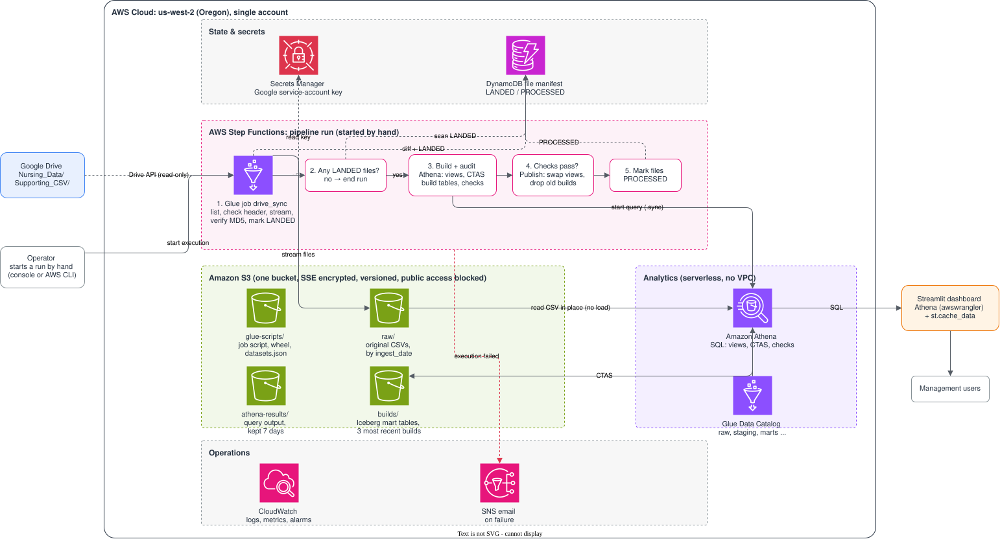

# Healthcare Staffing Lakehouse

An AWS lakehouse that turns CMS nursing-home staffing data (Payroll-Based Journal, Q2 2024, ~1.3M daily facility records) into staffing metrics and a dashboard: nurse hours per resident day, contract-staff share, and how often facilities fall below the CMS 2024 staffing benchmark.

> 🚧 **In progress.** Built step by step. See the [roadmap](#roadmap).

## Architecture



- **Ingestion:** a Glue Python shell job copies CSVs from Google Drive into S3 incrementally, tracked in a DynamoDB manifest.
- **Medallion layers:** bronze (raw CSV in S3), silver (validated Iceberg tables), gold (star schema and metrics), all queried with Athena.
- **Quality gates:** each run builds new tables, checks them, and publishes only if the checks pass (write-audit-publish).
- **Orchestration:** Step Functions, started manually.
- **Infrastructure:** everything in Terraform, deployed to `us-west-2`.

Full reasoning, trade-offs and rejected alternatives: [solution design](docs/solution-design.md) · [summary](docs/solution-design-summary.md)

## Tech stack

AWS (S3, Glue, Athena, Step Functions, DynamoDB, Secrets Manager, CloudWatch, SNS) · Apache Iceberg · Terraform · Python · SQL · Streamlit

## Repository layout

| Path | Contents |
|---|---|
| `docs/` | Solution design, summary and architecture diagram |
| `terraform/` | Infrastructure as code *(planned)* |
| `glue/` | Ingestion job *(planned)* |
| `sql/` | Silver and gold transformations and data checks *(planned)* |
| `datasets/` | Dataset contract (`datasets.json`) *(planned)* |
| `dashboard/` | Streamlit app *(planned)* |
| `data/` | Local source files (not committed; see `data/README.md`) |

## Development setup

```bash
python3 -m venv .venv
source .venv/bin/activate
python -m pip install -r requirements-dev.txt
pre-commit install
```

Every commit is checked automatically, including secret scanning with gitleaks.

## Deployment

All infrastructure is defined in Terraform and deployed to `us-west-2`, in two stacks applied in order: `bootstrap` (the state bucket) and `envs/dev` (the project).

### Prerequisites

- Terraform 1.10 or newer (needed for S3 native state locking)
- AWS CLI v2, signed in to the target account: `aws sts get-caller-identity` should show it
- Permission in that account to create S3 buckets and the project's resources

### 1. Set your AWS account ID

Each stack refuses to run against any other account (`allowed_account_ids`). Copy the example files and set `account_id` to the number printed by the last command. The real `terraform.tfvars` files are git-ignored.

```bash
cp terraform/bootstrap/terraform.tfvars.example terraform/bootstrap/terraform.tfvars
cp terraform/envs/dev/terraform.tfvars.example terraform/envs/dev/terraform.tfvars
aws sts get-caller-identity --query Account --output text
```

### 2. Bootstrap the state bucket (once)

Creates a versioned, encrypted, TLS-only S3 bucket for Terraform state, protected against deletion. This small stack keeps its own state file locally (git-ignored).

```bash
terraform -chdir=terraform/bootstrap init
terraform -chdir=terraform/bootstrap apply
terraform -chdir=terraform/bootstrap output state_bucket_name
```

### 3. Deploy the dev environment

Set `bucket` in the `backend "s3"` block of `terraform/envs/dev/versions.tf` to the bucket name from step 2. It has to be typed in literally, because Terraform reads the backend during `init`, before any variables exist.

```bash
terraform -chdir=terraform/envs/dev init
terraform -chdir=terraform/envs/dev plan
terraform -chdir=terraform/envs/dev apply
```

The dev state is stored in the bucket at `envs/dev/terraform.tfstate` and locked during every run, so two applies can't overlap.

## Roadmap

- [x] Repository foundation: gitignore, pre-commit, secret scanning
- [x] Terraform foundation: remote state, provider, tagging
- [ ] Lake storage, Glue Data Catalog, Athena workgroups
- [ ] Dataset contract and bronze tables
- [ ] Ingestion job (Google Drive → S3)
- [ ] Data profiling on bronze
- [ ] Silver layer
- [ ] Gold layer and data checks
- [ ] Orchestration with Step Functions
- [ ] Dashboard
