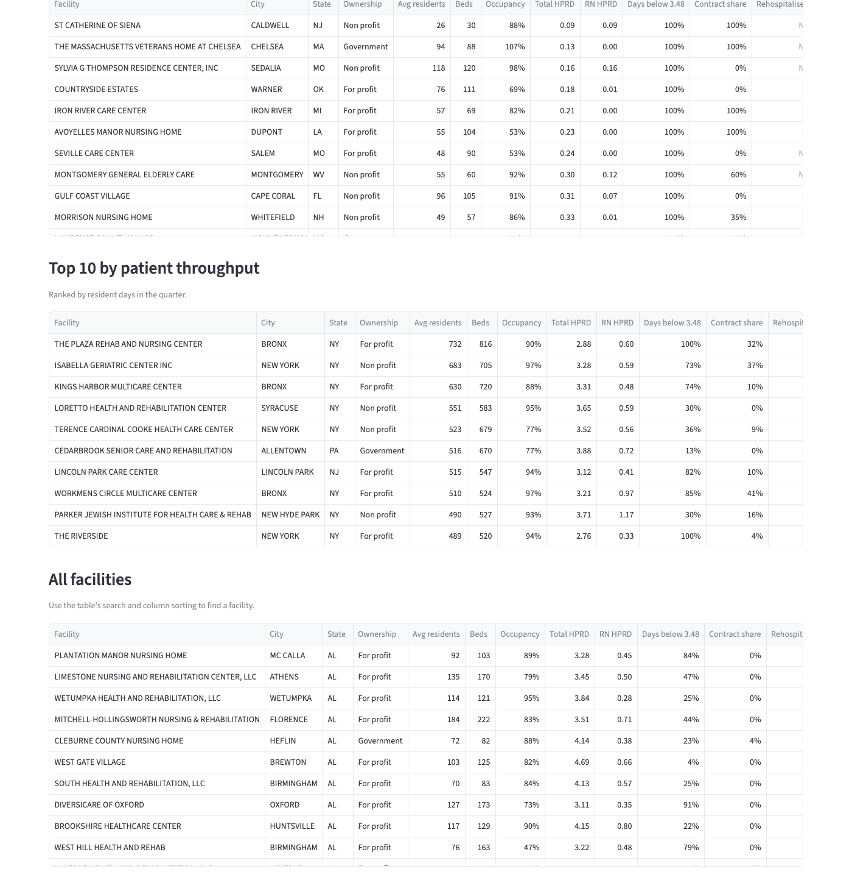

# Findings

| | |
|---|---|
| **Data** | CMS Payroll-Based Journal daily nurse staffing, Q2 2024 (1 April to 30 June): 1,322,727 valid facility-days from 14,564 facilities. Facility attributes, ratings and rehospitalisation are from the October 2024 CMS provider files. |
| **Source tables** | The published `marts` views (`agg_facility_month`, `fact_daily_staffing`, `dim_facility`, `dim_date`), from pipeline run `r20261009_022415` |
| **Metric definitions** | [Data dictionary](data-dictionary.md). HPRD = nursing hours per resident day, with CMS's hour groupings. |
| **Benchmarks** | 3.48 total and 0.55 RN HPRD, from the 2024 CMS minimum staffing rule. Its enforcement has been delayed, so it's used as a **reference only**. |

The brief asked four questions. Two of them can't be answered from this data, and those sections say why and give the closest measure that is available.

## 1. What is the relationship between nurse staffing levels and occupancy?

**There's almost none.** Across 14,537 facilities, total HPRD and occupancy correlate at **−0.06** (rank correlation 0.02). Staffing per resident is nearly flat across occupancy bands:

| Occupancy | Facilities | Total HPRD | RN HPRD | Days below 3.48 |
|---|---|---|---|---|
| Under 60% | 2,106 | 3.79 | 0.63 | 40% |
| 60–75% | 3,009 | 3.71 | 0.60 | 41% |
| 75–90% | 5,184 | 3.70 | 0.60 | 39% |
| 90–100% | 4,087 | 3.72 | 0.60 | 36% |
| Over 100%* | 151 | 3.89 | 0.67 | 34% |

So facilities scale staff with their resident count: a fuller facility doesn't have thinner staffing per resident. Emptier facilities staff slightly more per resident, which is consistent with fixed minimum staffing spread over fewer residents.

\*Census is from Q2 2024 and beds from October 2024. A facility that reduced its beds in between can show more than 100%.

## 2. Which facilities have the highest nurse overtime hours?

**This can't be answered from this data.** The PBJ file records hours per day by role and employment type (employee or contract). It doesn't separate regular from overtime hours, and it has no pay data.

**Closest available measure: contract-staff share,** the share of nursing hours worked by agency or contract staff. Like overtime, it's what facilities use when they can't cover shifts with their own staff.

- Nationally, **7.0%** of nursing hours are contract. **60.5%** of facilities used some contract staff, and **1,105 facilities** relied on contract staff for more than a quarter of their hours.
- Highest by state: **Vermont 29.6%**, Maine 15.9%, New Hampshire 15.4%, Pennsylvania 14.4%, New Jersey 14.0%.
- Several facilities report **100% contract hours** with normal staffing levels. For example, Cumming Operating Company (GA, 3.93 HPRD), Coral Reef Subacute Care Center (FL, 3.65) and Sun Harbor Healthcare (FL, 3.78). That pattern more likely reflects an arrangement where all staff are employed by a related staffing or management company than temporary agency cover. The dashboard's facility table lists them all.

## 3. What are the average staffing levels by state and facility type?

**By state** (total HPRD, weighted by resident days):

| Lowest | HPRD | RN HPRD | Days below 3.48 | | Highest | HPRD | RN HPRD | Days below 3.48 |
|---|---|---|---|---|---|---|---|---|
| Illinois | 3.25 | 0.66 | 58% | | Alaska | 6.01 | 1.78 | 0% |
| Missouri | 3.25 | 0.38 | 59% | | Oregon | 5.01 | 0.63 | 2% |
| Texas | 3.30 | 0.38 | 64% | | Puerto Rico | 4.79 | 3.56 | 18% |
| New Mexico | 3.39 | 0.61 | 60% | | North Dakota | 4.65 | 0.88 | 13% |
| West Virginia | 3.45 | 0.61 | 54% | | Hawaii | 4.45 | 1.43 | 13% |

**By ownership type**, the clearest divide in the data:

| Ownership | Facilities | Total HPRD | RN HPRD | Days below 3.48 |
|---|---|---|---|---|
| For profit (all four types) | 10,628 | 3.58 | 0.55 | 44% |
| Government (all types) | 908 | 4.10 | 0.74 | 31% |
| Non profit (all types) | 3,011 | 4.17 | 0.79 | 21% |

- Within each group, the subtypes are consistent: every for-profit type sits between 3.57 and 3.59 HPRD.
- **State-run government facilities have the most staff (4.82).**
- **Hospital-district facilities have the least (3.53).**

## 4. What trends are there in patient length of stay over time?

**This can't be answered from this data.** None of the source files record admissions, discharges or length of stay. PBJ counts residents per day, but not how long each resident stays. The quarter is also only three months long, which is too short for a trend.

**Closest available measure: resident census.** The average number of residents per day was stable across the quarter: **1,211,944 in April, 1,213,102 in May and 1,214,309 in June** (+0.2%). Staffing was just as stable, at 3.72, 3.73 and 3.71 HPRD.

## Our own conclusions

1. **Weekends are the biggest staffing gap.** Total HPRD drops from **3.91 on weekdays to 3.26 on weekends**, and **RN hours per resident drop 40%** (0.68 to 0.41). Every weekend of the quarter falls below the 3.48 benchmark, even though weekdays sit comfortably above it. Weekend coverage is the most actionable finding for workforce planning.
2. **Ownership matters more than occupancy.** For-profit facilities staff about 14% fewer hours per resident than non-profits (3.58 against 4.17), and spend twice as many days below the benchmark (44% against 21%). Occupancy shows no meaningful relationship with staffing.
3. **The RN benchmark is the harder one to meet.** 47% of facilities average below 0.55 RN HPRD over the quarter, against 37% below 3.48 total HPRD. The threshold sits almost exactly at the national median, which is why the dashboard reports the two benchmarks separately.
4. **Staffing barely predicts rehospitalisation.** Across 11,817 facilities with a published score, total HPRD and the short-stay rehospitalisation rate (CMS measure 521) correlate at only **−0.06** (−0.08 for RN hours). Better-staffed facilities rehospitalise very slightly less often, but the effect is small. Rehospitalisation depends heavily on case mix, which this data can't separate. **This is correlation, not causation.**
5. **Some low numbers are data problems, not staffing.** 26 facilities report under 1.0 HPRD, and some report 0.09. These are almost certainly incomplete payroll submissions. They're kept and flagged rather than hidden, at the top of the dashboard's "lowest staffing" table (below). The pipeline also quarantined 2,597 facility-days with residents but no nursing hours, or with impossible values ([data profile](data-profile.md)).

## Limits

- **One quarter only:** seasonal effects and year-on-year trends aren't visible.
- **Snapshot mismatch:** facility attributes (beds, ownership, ratings) are from October 2024, while staffing is from Q2 2024.
- **Not in the data:** overtime, pay, shifts, departments, length of stay and patient satisfaction. Metrics that would need them weren't built.
- **The benchmark is a reference, not a legal test:** the 2024 rule's enforcement has been delayed, and its current status should be checked before these numbers are used for compliance.
